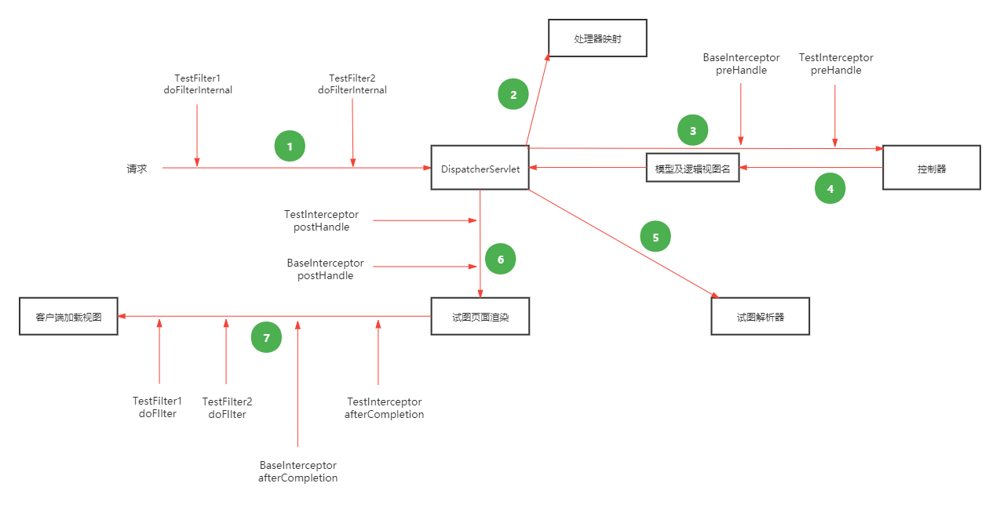
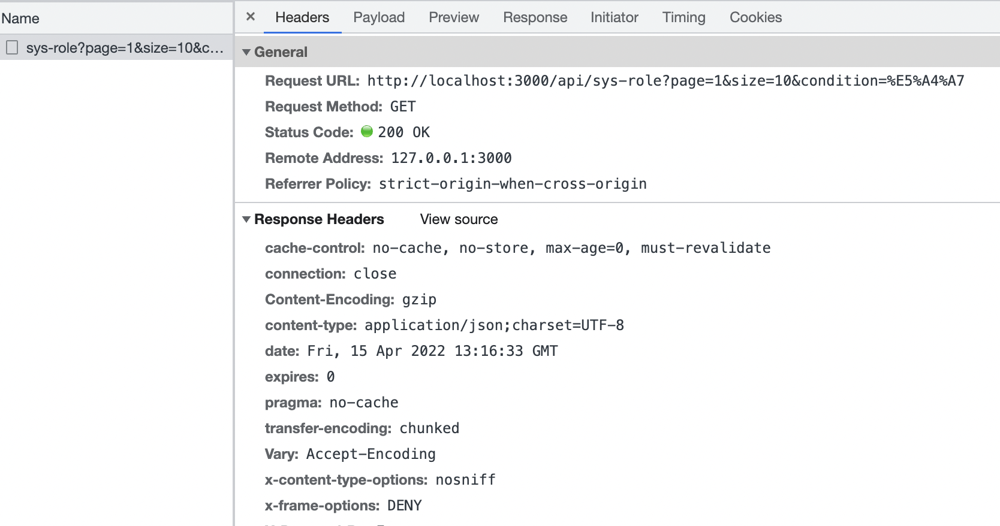
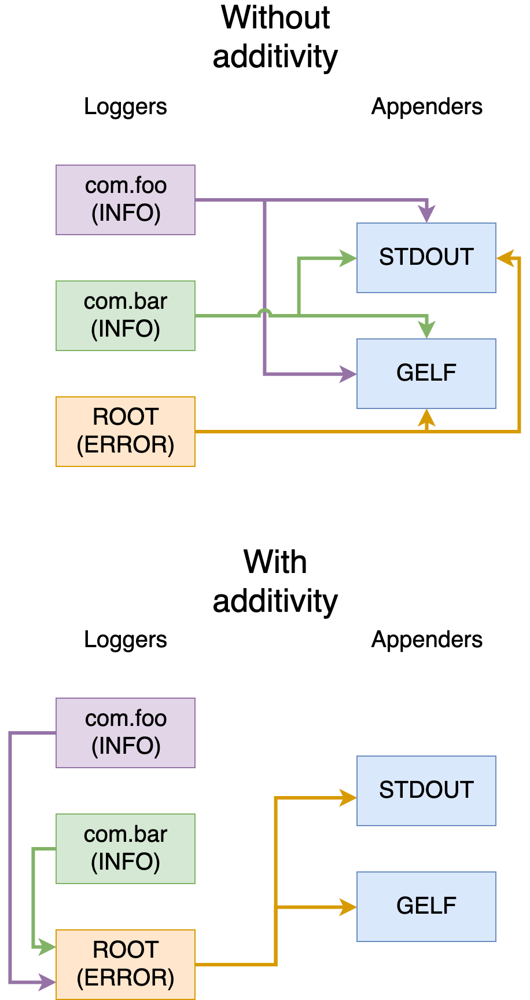

# 文档

学习工作记录文档，包括学习总结和工作中遇到的问题记录。

## 学习记录

### Unit Test

最近学习了一些Java Unit Test方面的知识，空闲之余归纳总结一下，加深记忆。

现在主流的开发一般都是基于SpringBoot框架开发的，结构大多数是Controller + Service + DAO，Controller一般是数据展示层，Service是业务逻辑层，DAO一般是数据持久层，持久层会使用ORM框架开发。因此我们的单元测试是基于这三层进行的，ORM框架选择的是Mybatis-Plus，测试框架使用的Spring自带的Junit4和Junit5。

测试用到的一些测试工具：

```java
    testImplementation 'org.springframework.boot:spring-boot-starter-test'
    testImplementation 'org.springframework.security:spring-security-test'		
		testImplementation 'junit:junit:4.13.1'
    testImplementation 'org.junit.jupiter:junit-jupiter-api:5.7.0'
    testImplementation 'com.h2database:h2:2.1.210'
    testRuntimeOnly 'org.junit.jupiter:junit-jupiter-engine:5.7.0' // Junit5 engine
    testRuntimeOnly 'org.junit.vintage:junit-vintage-engine:5.7.0' // Junit4 engine
    testCompileOnly 'org.mockito:mockito-junit-jupiter:2.19.0'
    testCompileOnly 'org.mockito:mockito-core:2.19.0'
    testImplementation "org.testcontainers:mysql:1.16.3"
    testImplementation "org.testcontainers:junit-jupiter:1.16.3"
```

#### Controller

Controller中使用到的关键注解和类有：

* @WebMvcTest
* @MockBean
* @BeforeEach
* MockMvc

@WebMvcTest 是用于只关注Spring MVC组件的Spring MVC测试的注释， 使用此注释将禁用完全自动配置，而只应用于与MVC测试相关的配置，不能应用于@Component、@Service或@Repository 这些bean。一般该注解位于测试类上面的。如果想加载完整的应用程序配置并使用MockMVC，那么应该考虑结合@SpringBootTest和@AutoConfigureMockMvc来代替这个注释，这种情况多用于集成测试。

```java
/**
 * TraceBatchesController uint test.
 */
@WebMvcTest(TraceBatchesController.class)
class TraceBatchesControllerTest {
}
```

#### Service

Service层的测试用到了一些测试工具，分别有：

* Mockito
* spring-boot-starter-test

Mockito主要是用来做存根的，当方法中需要调用其他对象的引用，如果不想真实的去调用可以使用Mockito去模拟调用返回想要的结果。Mockito中有许多定义的注解，可以很方便的去模拟不同的对象，其中最常用的就是@InjectMocks、@Mock和@Spy注解。

> @InjectMocks

该注解标记的字段表明该对象是一个可以注入依赖的对象，通常会将标记了@Mack的字段注入到该对象中，所以@InjectMocks注解通常会和@Mock注解结合使用。**注：这些注解标注的字段此时还未初始化，可以手动初始化也可以使用注解@ExtendWith(MockitoExtension.class)自动初始化，Junit5使用的@ExtendWith(MockitoExtension.class)，Junit4使用的是 @RunWith(MockitoJUnitRunner.class)**

> @Mock

该注解是用来模拟真实的对象的，模拟后可使用when...thenReturn...的方式模拟对象方法的调用，真实的逻辑在调用该方法时会返回模拟对应的返回值，从而达到真实逻辑运行的效果。@Mock注解通常会和@InjectMocks注解结合使用。

> @Spy

该注解是用来实现模拟对象的部分真实逻辑的，当你真实的创建一个类的对象后，想测试该类的A方法时，发现方法内部又调用了该类的B方法，此时你不想真正的去走B方法希望可以模拟B方法，这时你就可以使用@Spy去实现该场景。

Service层逻辑

​	主要是创建traceBatches这个类，然后将traceBatches保存到数据库，后面会添加相应的数据权限给当前用户。

```java
@Service
public class TraceBatchesServiceImpl extends MPJBaseServiceImpl<TraceBatchesMapper, TraceBatches>
    implements ITraceBatchesService, ILuwuService {
  
  private final IAttachmentService attachmentService;
  
  @Value("${trace-batches.switch.extension-enable}")
  private Boolean extensionEnable;

  @Value("${trace-batches.switch.closed-enable}")
  private Boolean closedEnable;
  
  @Lazy
  public TraceBatchesServiceImpl(final IAttachmentService attachmentService) {
    super();
    this.attachmentService = attachmentService;
  }
  
  public Integer create(final TraceBatchesAddRequest request,
      final UserDTO userdto) throws SqlOtherException, DuplicatedTraceBatchesException {

    final TraceBatches traceBatches = generateTraceBatches(request, userdto);
    try {
      save(traceBatches);
    } catch (DuplicateKeyException e) {
      log.warn("saving traceBatches volatile unique constraint", e);
      if (Objects.requireNonNull(e.getMessage())
          .contains(Constants.UNIQUE_CONFLICT_ERROR_MESSAGE)) {
        throw new DuplicatedTraceBatchesException("duplicated creation with traceBatches", e,
            traceBatches);
      }
      throw new SqlOtherException("Saving traceBatches encounters "
          + "other sql exception", e);
    }

    final ItemRequest itemRequest = generateItemRequest(traceBatches.getId(),
        request.getProductId(), userdto);
    permission(itemRequest, userdto);

    return traceBatches.getId();
  }
  
  public TraceBatches generateTraceBatches(final TraceBatchesAddRequest request,
      final UserDTO userdto) {
    final TraceBatches traceBatches = new TraceBatches();
    // do some set things
    return traceBatches;
  }
  
  public ItemRequest generateItemRequest(final int traceBatchesId,
      final int productId,
      final UserDTO userdto) {
    final ItemRequest itemRequest = new ItemRequest();
    // do some set things
    return itemRequest;
  }
}
```

Service Test层逻辑

​	Base Service Test 通常建立一个基础类，让该类去添加通用注解，测试去继承该类去初始化对应的模拟对象。

```java
import org.junit.jupiter.api.extension.ExtendWith;
import org.mockito.junit.jupiter.MockitoExtension;

/**
 * base service test for enable Mockito annotations
 * to use @InjectMocks and @Mock annotation.
 */
@ExtendWith(MockitoExtension.class)
public class BaseServiceTest {
}
```

​	TraceBatch Service Test 首先通过@InjectMocks和@Mock去确定要测试对象并注入关联对象。

```java
class TraceBatchesServiceImplTest extends BaseServiceTest {
  @InjectMocks
  private TraceBatchesServiceImpl traceBatchesServiceTest;
  @Mock
  private IAttachmentService attachmentService;
}
```

​	然后去创建测试方法去测试真实的create方法逻辑，此时发现要测试的create方法中用到了save方法，但是save方法不是TraceBatchesServiceImpl本身的方法，到这里我们知道要去模拟save这个方法了。查看源码找到这个save方法是IService接口内的默认方法。

```java
public interface IService<T> {
  ...
  default boolean save(T entity) {
      return SqlHelper.retBool(getBaseMapper().insert(entity));
  }
  ...
}
```

​	去模拟save方法就是要对测试类中的部分方法做模拟，所以可以用spy的方式去实现。细心观察这里多加了一个`generateTraceBatches`方法的模拟，是为了保证真实的save方法中的参数和模拟的参数相一致。**注意模拟save方法时传参一定要和真实的传参一致，如果参数是对象那么内部的set值也要完全一样，不然真实逻辑不会流转到模拟的方法上。**

```java
  // 将traceBatchesServiceTest赋值给spy，是用spy去模拟部分方法
	final TraceBatchesServiceImpl spy = spy(traceBatchesServiceTest);
	// 调用真实的方法创建traceBatches对象
  final TraceBatches traceBatches = spy.generateTraceBatches(traceBatchesAddRequest, userDto);
  traceBatches.setId(ID);
  doReturn(traceBatches).when(spy).generateTraceBatches(traceBatchesAddRequest, userDto);
  doReturn(true).when(spy).save(traceBatches);
```

​	最后使用assert去判断create方法返回结果。

```java
  Assertions.assertEquals(ID, (long) spy.create(traceBatchesAddRequest, userDto),"test: result is equal");
  verify(spy, times(1)).create(traceBatchesAddRequest, userDto);
```

​	完整示例：

```java
import static org.mockito.Mockito.doNothing;
import static org.mockito.Mockito.doReturn;
import static org.mockito.Mockito.doThrow;
import static org.mockito.Mockito.spy;
import static org.mockito.Mockito.times;
import static org.mockito.Mockito.verify;

import java.lang.reflect.Field;
import org.junit.jupiter.api.Assertions;
import org.junit.jupiter.api.BeforeEach;
import org.junit.jupiter.api.Test;
import org.mockito.InjectMocks;
import org.mockito.Mock;
import org.springframework.dao.DuplicateKeyException;

/**
 * TraceBatchesService unit test.
 */
@SuppressWarnings({"PMD.AtLeastOneConstructor",
    "PMD.TooManyStaticImports", "PMD.TooManyMethods"})
class TraceBatchesServiceImplTest extends BaseServiceTest {

  private static final int ID = 1;
  private static final int PRODUCT_ID = 1;
  public static final String EXTENSION = "extension";

  @InjectMocks
  private TraceBatchesServiceImpl traceBatchesServiceTest;

  @Mock
  private IAttachmentService attachmentService;

  private TraceBatchesAddRequest traceBatchesAddRequest;
  private UserDTO userDto;

  @BeforeEach
  void init() {
    traceBatchesServiceTest = new TraceBatchesServiceImpl(productMapper,
         markMapper, stepTempService, stepDetailService,
        attachmentService, iotInfoService, deviceService, warnPolicyService,
        executorLuwuService, excelUtils);

    traceBatchesAddRequest = new TraceBatchesAddRequest();
    traceBatchesAddRequest.setProductId(PRODUCT_ID);
    traceBatchesAddRequest.setProductNum((long) 10);
    traceBatchesAddRequest.setExtension(EXTENSION);
    traceBatchesAddRequest.setNote("5");
    traceBatchesAddRequest.setClosed(true);

    userDto = new UserDTO();
    userDto.setUsername("admin");
    userDto.setAppId("754");
  }

  void stubSave(final TraceBatchesServiceImpl spy) {
    final TraceBatches traceBatches =
        spy.generateTraceBatches(traceBatchesAddRequest, userDto);
    traceBatches.setId(ID);
    final ItemRequest itemRequest =
        spy.generateItemRequest(traceBatches.getId(), traceBatches.getProductId(), userDto);
    doReturn(traceBatches).when(spy).generateTraceBatches(traceBatchesAddRequest, userDto);
    doReturn(true).when(spy).save(traceBatches);
    doNothing().when(spy).permission(itemRequest, userDto);
  }

  void stubSaveThrow(final TraceBatchesServiceImpl spy, final String errorMsg) {
    final TraceBatches traceBatches = spy.generateTraceBatches(traceBatchesAddRequest, userDto);
    doReturn(traceBatches).when(spy).generateTraceBatches(traceBatchesAddRequest, userDto);
    doThrow(new DuplicateKeyException(errorMsg)).when(spy).save(traceBatches);
  }

  @Test
  void createTest() throws NoSuchFieldException, IllegalAccessException,
      SqlOtherException, DuplicatedTraceBatchesException {
    updateField(true, true);
    final TraceBatchesServiceImpl spy = spy(traceBatchesServiceTest);
    stubSave(spy);

    final int actual = spy.create(traceBatchesAddRequest, userDto);
    Assertions.assertEquals(ID, (long) actual, "test: method result is equal");
    verify(spy, times(1))
        .create(traceBatchesAddRequest, userDto);
  }

  @Test
  void createThrowDuplicateTest()
      throws SqlOtherException, DuplicatedTraceBatchesException,
      NoSuchFieldException, IllegalAccessException {
    updateField(true, true);
    final TraceBatchesServiceImpl spy = spy(traceBatchesServiceTest);
    stubSaveThrow(spy, Constants.UNIQUE_CONFLICT_ERROR_MESSAGE);

    Assertions.assertThrows(DuplicatedTraceBatchesException.class,
        () -> spy.create(traceBatchesAddRequest, userDto));
    verify(spy, times(1))
        .create(traceBatchesAddRequest, userDto);
  }

  @Test
  void createThrowSqlOtherTest()
      throws SqlOtherException, DuplicatedTraceBatchesException,
      NoSuchFieldException, IllegalAccessException {
    updateField(true, true);
    final TraceBatchesServiceImpl spy = spy(traceBatchesServiceTest);
    stubSaveThrow(spy, "other exception sql");

    Assertions.assertThrows(SqlOtherException.class,
        () -> spy.create(traceBatchesAddRequest, userDto));
    verify(spy, times(1))
        .create(traceBatchesAddRequest, userDto);
  }

  @Test
  void generateTraceBatchesForExtensionTrueTest()
      throws NoSuchFieldException, IllegalAccessException {
    updateField(true, true);

    final TraceBatches actual = traceBatchesServiceTest
        .generateTraceBatches(traceBatchesAddRequest, userDto);
    Assertions.assertEquals(EXTENSION, actual.getExtension(),
        "test: extension result is equal");
  }

  @Test
  void generateTraceBatchesForExtensionFalseTest()
      throws NoSuchFieldException, IllegalAccessException {
    updateField(false, false);

    final TraceBatches actual = traceBatchesServiceTest
        .generateTraceBatches(traceBatchesAddRequest, userDto);
    Assertions.assertNotNull(actual.getExtension());
  }

  @Test
  void generateTraceBatchesForClosedTrueTest()
      throws NoSuchFieldException, IllegalAccessException {
    updateField(false, true);

    final TraceBatches actual = traceBatchesServiceTest
        .generateTraceBatches(traceBatchesAddRequest, userDto);
    Assertions.assertNotNull(actual.getClosed());
  }

  @Test
  void generateTraceBatchesForClosedFalseTest()
      throws NoSuchFieldException, IllegalAccessException {
    updateField(true, false);

    final TraceBatches actual = traceBatchesServiceTest
        .generateTraceBatches(traceBatchesAddRequest, userDto);
    Assertions.assertEquals("0", actual.getClosed(),
        "test: closed result is equal");
  }

  @SuppressWarnings("PMD.AvoidAccessibilityAlteration")
  void updateField(final boolean extensionEnable, final boolean closedEnable)
      throws IllegalAccessException, NoSuchFieldException {
    final Field field = traceBatchesServiceTest.getClass().getDeclaredField("extensionEnable");
    field.setAccessible(true);
    field.set(traceBatchesServiceTest, extensionEnable);

    final Field closedField = traceBatchesServiceTest.getClass().getDeclaredField("closedEnable");
    closedField.setAccessible(true);
    closedField.set(traceBatchesServiceTest, closedEnable);
  }

}
```


#### Mapper

Mapper的测试有多种方式，目前比较常用的有spring test集成h2以及spring test集成testcontainer，由于h2配置简单，下面主要介绍一下testcontainer这种方式。

H2：h2的优点就是启动方式简单，速度快；缺点就是h2的部分语法和mysql不兼容，同时会在系统中存在两份初始化sql脚本，会导致两边修改不一致；

Testcontainer：优点是使用docker启动一个mysql实例，初始化数据库脚本可以和系统的是同一份，保证了环境的一致性；缺点是开发者本地需要安装docker，并且CI中要使用docker in docker的模式，启动也比较复杂。

Mapper中使用到的关键注解有：

* @Testcontainers
* @SpringBootTest
* @Container
* @DynamicPropertySource
* @DirtiesContext
* @BeforeEach
* @AfterEach

> @Testcontainers

主要是用作测试中自动启动、停止容器的。测试容器会找到所有用Container标注的字段，并在容器的生命周期内调用它们的方法。**注：声明为静态字段的容器将在测试方法之间共享，它们只会在任何测试方法执行之前启动一次，并在最后一个测试方法执行之后停止。声明为实例字段的容器将为每个测试方法启动和停止**。

> @Container

与Testcontainers注释一起使用，以标记容器由testcontainer去管理。

> @DynamicPropertySource

用于集成测试的方法级注释，这些测试需要将具有动态值的属性添加到环境的PropertySource中。

> @DirtiesContext

主要是用于清除Spring中ApplicationContext的上下文缓存信息的，一般是和@DynamicPropertySource联合使用，使Spring的Bean每次使用修改后的环境变量。如果在测试类上，使用@DirtiesContext注解，待整个测试类的所有测试执行结束后，该测试的ApplicationContext会被关闭，同时缓存会清除。

**Mapper层逻辑**

```java
@Mapper
public interface TraceBatchesMapper extends MPJBaseMapper<TraceBatches> {
  @Select("select id batchId, batch_no batchNo from trace_batches "
      + " where product_id=#{productId} and deleted=0 ")
  List<MarkTraceBatchSelectorDTO> selectByProductId(int productId);
}
```

**Mapper Test层逻辑**

```java
/**
 * TraceBatchesMapperTest unit test.
 */
@SpringBootTest(webEnvironment = SpringBootTest.WebEnvironment.RANDOM_PORT)
class TraceBatchesMapperTest extends BaseMapperTest {
  private static final String BATCH_NO = "BN00001";
  private static final int PRODUCT_ID = 1;
  private static final int STEP_TEMP_ID = 1;

  @Autowired
  private TraceBatchesMapper traceBatchesMapper;

  @BeforeEach
  void init() {
    final TraceBatches traceBatches = generateTraceBatches();
    traceBatchesMapper.insert(traceBatches);
  }
  
  @Test
  void testSelectByProductId() {
    final List<String> expected = expectedResponse();
    final List<MarkTraceBatchSelectorDTO> selectorDtoS =
        traceBatchesMapper.selectByProductId(PRODUCT_ID);
    final List<String> list = selectorDtoS.stream()
        .map(MarkTraceBatchSelectorDTO::getBatchNo).toList();
    Assertions.assertArrayEquals(expected.toArray(), list.toArray(), "test list equal");
  }

  @AfterEach
  void clean() {
    traceBatchesMapper.deleteById(PRODUCT_ID);
  }
  
  private TraceBatches generateTraceBatches() {
    final TraceBatches traceBatches = new TraceBatches();
    traceBatches.setProductId(PRODUCT_ID);
    traceBatches.setProductNum(10L);
    traceBatches.setStepTempId(1);
    traceBatches.setNote("test");
    traceBatches.setUpdateBy("system");
    traceBatches.setCreatedBy("system");
    traceBatches.setCreatedTime(DateTimeUtil.nowOfUTF8());
    traceBatches.setUpdateTime(traceBatches.getCreatedTime());
    traceBatches.setBatchNo(BATCH_NO);
    traceBatches.setStatus(com.zhigui.cube.utils.Constants.PENDING);
    traceBatches.setDeleted(com.zhigui.cube.utils.Constants.NOT_DISABLE);
    traceBatches.setAppId("test");
    traceBatches.setExtension(UUID.randomUUID().toString().replace("-", ""));
    traceBatches.setClosed(UUID.randomUUID().toString().replace("-", ""));
    return traceBatches;
  }

  private List<String> expectedResponse() {
    final List<String> list = new ArrayList<>();
    list.add(BATCH_NO);
    return list;
  }
}
```

**BaseMapperTest 逻辑**

​		容器启动之后会去默认的目录初始化sql文件，一般我们可以把sql文件放到默认的resource下面，但是一般的初始化数据库脚步不会放到test下的resource下，这样就没发统一去维护。启动容器之前我们可以通过withFileSystemBind将脚本文件映射到容器的默认目录下，这样就可以实现维护和真实数据库同一份的脚本。

```java
import java.io.IOException;
import java.nio.file.Paths;
import lombok.extern.slf4j.Slf4j;
import org.springframework.test.context.DynamicPropertyRegistry;
import org.springframework.test.context.DynamicPropertySource;
import org.testcontainers.containers.MySQLContainer;
import org.testcontainers.junit.jupiter.Container;
import org.testcontainers.junit.jupiter.Testcontainers;
import org.testcontainers.utility.DockerImageName;
/**
 * base mapper test for enable Testcontainers annotations
 * to manage docker container.
 */
@Slf4j
@Testcontainers
@DirtiesContext
public class BaseMapperTest {

  /**
   * The @Container annotation tells JUnit to notify this field
   * about various events in the test lifecycle.
   */
  @Container
  @SuppressWarnings("PMD.FieldNamingConventions")
  private static MySQLContainer<?> mysqlContainer;

  static {
    try {
      mysqlContainer = new MySQLContainer<>(DockerImageName.parse(Constants.MYSQL_IMAGE_NAME))
          .withUsername(Constants.MYSQL_USER_NAME)
          .withPassword(Constants.MYSQL_PASSWORD)
          .withDatabaseName(Constants.MYSQL_DATABASE_NAME)
          // 脚本文件路径直接挂在到镜像的指定目录，mysql container会在启动时自动加载此目录中的脚本文件
          .withFileSystemBind(Paths.get("./doc/db/cube.sql").toRealPath().toString(),
              "/docker-entrypoint-initdb.d/1-cube.sql")
          .withFileSystemBind(Paths.get("./doc/db/user.sql").toRealPath().toString(),
              "/docker-entrypoint-initdb.d/2-user.sql")
          .withFileSystemBind(Paths.get("./src/test/resources/sql/data.sql")
                  .toRealPath().toString(),
              "/docker-entrypoint-initdb.d/3-data.sql")
          .withCommand("--character-set-server=utf8 --collation-server=utf8_unicode_ci");
    } catch (IOException e) {
      log.error("create test container failed");
    }
  }

  @DynamicPropertySource
  static void mysqlProperties(final DynamicPropertyRegistry registry) {
    registry.add("spring.datasource.url", mysqlContainer::getJdbcUrl);
    registry.add("spring.datasource.password", mysqlContainer::getPassword);
    registry.add("spring.datasource.username", mysqlContainer::getUsername);
  }

}
```

**H2配置**

如果想使用h2的方法，可以在spring的配置文件yaml中修改数据库连接信息，具体实例如下：

```yaml
# DataSource Config
spring:
  datasource:
    driver-class-name: org.h2.Driver
    schema: classpath:db/schema-h2.sql
    data: classpath:db/data-h2.sql
    url: jdbc:h2:mem:test
    username: root
    password: test
  h2:
    console:
      enabled: true
```

schema是数据库初始化表结构的脚步文件，data是数据库初始化数据的脚本文件，后续的测试逻辑和前面的基本类似，mybatis会通过配置文件的数据库信息连接h2数据库做相应的操作。


#### Other

##### 测试私有方法

我们先定义一个类，这个类中有一个公有方法和一个私有方法，类定义如下：

```java
public class Demo {
  public void publicMethod() {
  }
  
  private String privateMethod() {
    return "This is a private method."
  }
}
```

1. 使用反射

​	然后我们使用反射来测试这个类的私有方法

```java
public class DemoTest throws NoSuchMethodException, InvocationTargetException, IllegalAccessException {
  @Test
  void testPrivateMethod() {
    Demo demo = new Demo();
    Method privateMethod = demo.getClass().getDeclaredMethod("privateMethod");
    privateMethod.setAccessible(true);
    Assertions.assertEquals("This is a private method.", privateMethod.invoke(demo));
  }
}
```

2. 使用Spring的工具类

```java
public class DemoTest {
  @Test
  void testPrivateMethod() {
    Demo demo = new Demo();
    
    // invokeMethod的第三个参数是一个数组，代表方法的传参
    Assertions.assertEquals("This is a private method.", ReflectionTestUtils
        .invokeMethod(demo, "privateMethod", null););
  }
}
```


##### Mock静态方法

定义类和相应的静态方法

```java
public class Demo() {
  public static String getStaticMethodString(String input) {
    return "This is your input: " + input;
  }
}
```

首先简单介绍一下几个模拟类的框架：

1) mockito是一个比较通用的模拟框架，使用比较广泛。mockito是通过cglib来构建一个被测试类的子类，从而去mock被测试类的方法。 如果类、方法等是final类型的或者是静态方法，由于这样的父类没发继承、静态方法无法从写导致mockito将无法做mock。
2) powermock是mockito的一个加强版，他在mockito的基础上扩展了对final、static修饰的类或对象的mock，但只能在junit4的框架下使用。

所以使用powermock来mock静态方法，先通过Gradle引入powermock的依赖：

```java
testImplementation 'org.powermock:powermock-module-junit4:2.0.9'
testImplementation 'org.powermock:powermock-api-mockito2:2.0.9'
```

如果想junit4和junit5一起使用，需要加入以下依赖：

```java
testImplementation 'junit:junit:4.13.1'
testImplementation 'org.junit.jupiter:junit-jupiter-api:5.7.0'
testRuntimeOnly 'org.junit.jupiter:junit-jupiter-engine:5.7.0'
testRuntimeOnly 'org.junit.vintage:junit-vintage-engine:5.7.0'
// 下面是mockito的依赖
testCompileOnly 'org.mockito:mockito-junit-jupiter:2.19.0'
testCompileOnly 'org.mockito:mockito-core:2.19.0'
```

powermock来mock静态方法：

```java
import org.junit.Before;
import org.junit.Test;
import org.junit.jupiter.api.Assertions;
import org.junit.runner.RunWith;
import org.powermock.api.mockito.PowerMockito;
import org.powermock.core.classloader.annotations.PrepareForTest;
import org.powermock.modules.junit4.PowerMockRunner;

/**
 * test class static methods using PowerMock under junit4 framework.
 */
@RunWith(PowerMockRunner.class)
@PrepareForTest(Demo.class)
public class DemoTest {

  @Before
  public void setup() {
    PowerMockito.mockStatic(Demo.class);
  }

  @Test
  public void testStaticMethod() {
    final String input = "msg test";
    final String output = "This is your input: msg test";
    PowerMockito.when(Demo.getStaticMethodString(input)).thenReturn(output);
    String res = Demo.getStaticMethodString(input);
    Assertions.assertEquals(output, res);
  }

}
```

注意：

1. @RunWith(PowerMockRunner.class)和@PrepareForTest(Demo.class)是必须要加的，且PrepareForTest内部的类是要对应包含静态方法的类；
2. 在使用mock前必须要先mock整个类，比如：PowerMockito.mockStatic(Demo.class)；
3. 测试类的框架必须是junit4，junit5不兼容powermock测试会报错；
4. junit4的@Test使用的是import org.junit.Test这个包，junit5的@Test使用的是import org.junit.jupiter.api.Test这个包。


##### Mock私有字段

通过spring的*org.springframework.test.util.ReflectionTestUtils*工具类来mock私有字段，该工具测试方便快捷。

类示例：

```java
public class Demo {
  @Value("${config.app.name}")
  private String fieldName;
  
  public String methodName() {
    return fieldName + "test";
  }
}
```

测试示例：

```java
@RunWith(PowerMockRunner.class)
@PrepareForTest(Demo.class)
public class DemoTest {
  
  @InjectMocks
  private Demo demo;

  @Before
  public void setup() {}

  @Test
  public void testMethod() {
    // demo对应的是被测试类的对象，“fieldName”是类中字段的名称，a表示字段mock的值
    ReflectionTestUtils.setField(demo, "fieldName", "a");
    Assertions.assertEquals("a test", demo.methodName());
  }

}
```

就像上面这种类的私有字段，可能是从配置文件中获取的环境变量；当我们在测试的时候给他设定一个初始值时由于字段是私有的无法获取，这是情况我们就可以使用ReflectionTestUtils来给字段设定初值，其实底层原理也是通过反射获取字段，再去动态的修改字段的内容。


#### Reference

[https://doczhcn.gitbook.io/junit5/index/index-2/annotations] (Junit 5官方文档中文版)

[https://javadoc.io/doc/org.mockito/mockito-core/latest/org/mockito/Mockito.html] (Mockito 官方文档)

[https://spring.io/guides/gs/testing-web/] (Spring Testing the Web Layer)

[https://medium.com/backend-habit/integrate-junit-and-mockito-unit-testing-for-controller-layer-91bb4099c2a5] (Web Layer)

[https://www.cnblogs.com/NeverCtrl-C/p/8996564.html] (Web Layer)

[https://baomidou.com/pages/226c21/] (Mybatis-Plus)

[https://github.com/binkley/modern-java-practices] (modern java practices)

[https://www.testcontainers.org/] (Testcontainers 官网)

[https://rieckpil.de/howto-write-spring-boot-integration-tests-with-a-real-database/] (Testcontainers mysql)

### Git

### Docker


### K8S

### Spring

#### SpringMVC

SpringMVC流转图：



过滤器和拦截器实现原理：

1. 过滤器（Filter）是基于函数回调
2. 拦截器（Intercepter）是基于Java的反射

## 问题记录

### CI/CD

#### DIND（docker in docker）

描述：编写集成测试，需要用到spicedb，通过代码的dockertest启动一个docker spicedb容器，通过grpc连接spicedb容器向其中添加数据做测试，gitlab-ci的test报错历史

> Could not start resource: : dial unix /var/run/docker.sock: connect: no such file or directory

原因：gitlab-ci中的镜象是golang，所以启动后runner-test内部只有golang的环境，并且宿主机启动runner的配置中也没有挂载docker.sock，导致内部无法访问外部的docker
修改：将gitlab-ci中的镜象改成docker镜象，同时添加service: docker-dind

> /bin/bash: line 115: docker: command not found

原因：把test-coverage中的image删掉了
修改：把test-coverage中的image加上，并且使用的是docker:19.03.13

> ERROR: error during connect: Get http://docker:2375/v1.40/info: dial tcp: lookup docker on 100.100.2.136:53: no such host

原因：由于没有给docker配置相应的docker主机
修改：给docker添加相应的主机，在service中添加：
services 
     name: docker:19.03.12-dind 
     alias: dockerhost
在gitlab-ci中添加：
variables:
     DOCKER_HOST: tcp://dockerhost:2375/

> ERROR: Cannot connect to the Docker daemon at tcp://dockerhost:2375/. Is the docker daemon running?

原因：由于我们使用的是docker官方的docker：dind镜像，该镜像在18.09+下做了变化，主要是TLS证书认证这块。gitlab没有适配这个变化
修改：gitlab-ci.yml文件里面添加一下配置：
variables:
     DOCKER_DRIVER: overlay2
     DOCKER_TLS_CERTDIR: ""

> /bin/sh: eval: line 127: go: not found

原因：命令行中去下载并安装golang，安装后没有生效，这是由于通过docker启动的这个runner-test是一个alpine环境，缺少很多基础依赖
修改：在gitlab-ci.yml中添加脚本安装必需的依赖，脚本命令：
	apk update && apk add -f --virtual build-essential
    apk add make
    apk add gcc
    apk add musl-dev

> uname -c uname: unrecognized option: c

原因：中间通过命令查看runner-test的系统信息，命令不对
修改：使用uname -a，系统信息：Linux runner-vxe1ctwm-project-1555-concurrent-0 4.18.0-147.5.1.el8_1.x86_64 #1 SMP Wed Feb 5 02:00:39 UTC 2020 x86_64 Linux

> cgo: exec gcc: exec: "gcc": executable file not found in $PATH

原因：缺少gcc依赖
修改：添加命令apk add gcc下载依赖

> Do you want to continue [Y/n]?

原因：安装过程有需要确认的步骤
解决：在 apk add 后加 -f强制执行，不需确认

> /bin/sh: eval: line 133: make: not found

原因：缺少make的依赖
解决：添加命令apk add make下载依赖

> _cgo_export.c:3:10: fatal error: stdlib.h: No such file or directory 3 | #include <stdlib.h>

原因：缺少stdlib.h的包
解决：添加以下命令：
	 sed -i 's/dl-cdn.alpinelinux.org/mirrors.aliyun.com/g' /etc/apk/repositories
     apk update && apk add -f --virtual build-essential

> panic: test timed out after 10m0s

原因：由于没有拉取spicedb的镜象，导致启动spicedb超时
解决：添加以下命令：
	  docker pull jauderho/spicedb:v1.1.0

> filter_test.go:340: rpc error: code = Unavailable desc = connection error: desc = "transport: Error while dialing dial tcp 127.0.0.1:32768: connect: connection refused" Error:  Condition never satisfied Test:  TestAuthzed_Filter Messages: could not start test server

原因：使用grpc连接spicedb发现连接被拒绝，是因为代码中用的是loaclhost，而runner-test中的docker主机是我们开始配置的dockerhost
解决：修改代码中的locahost，改为dockerhost，测试通过


总结：使用gitlab-ci的docker in docker要注意内部docker的环境依赖问题以及主机的配置问题

golang-ci.yaml 附件：

```yaml
# image: golang:1.16.12-alpine3.14
stages: # List of stages for jobs, and their order of execution
  - pull-code
  - lint-check
  - test
  - build
  - deploy

#pull-code-job:
#  stage: pull-code
#  before_script:
#    - echo "pull code start"
#  script:
#    - echo "pulling code"
#  after_script:
#    - echo "pull code end"
services:
  - name: docker:19.03.12-dind
    alias: dockerhost

variables:
  DOCKER_HOST: tcp://dockerhost:2375/
  DOCKER_DRIVER: overlay2
  DOCKER_TLS_CERTDIR: ""
  DOCKER_AUTH_CONFIG: https://hub-mirror.c.163.com

lint-check-job:
  stage: lint-check
  timeout: 300 seconds
    # 仅dev分支和test分支进行lint检查
    #  image:
    #    name: golangci/golangci-lint:v1.30.0-alpine
    #    entrypoint: [ "" ]entrypoint
    #  only:
    #    refs:
    #      - master
  # 修改特定目录时触发此job
  #    changes:
  #      - /
  tags:
    - bj-shell
  before_script:
    - echo "lint tool check source code start"
  script:
    - echo "lint tool checking"
    - go version
    - make lint
  after_script:
    - echo "lint tool check source code end"
  artifacts:
    reports:
      codequality: gl-code-quality-report.json
    paths:
      - gl-code-quality-report.json

build-job: # This job runs in the build stage, which runs first.
  stage: build
  before_script:
    - echo "Compile the code start"
  script:
    - echo "compling"
  after_script:
    - echo "Compile complete."

test-coverage: # This job runs in the test stage.
  stage: test    # It only starts when the job in the build stage completes successfully.
  image:
    name: docker:19.03.12
  tags:
    - bj-docker
  timeout: 3600 seconds
  before_script:
    - docker info
  script:
    - echo "prepare golang environment..."
    - wget https://studygolang.com/dl/golang/go1.16.7.linux-amd64.tar.gz && tar -C /usr/local -xzf go1.16.7.linux-amd64.tar.gz
    - mkdir /lib64 && ln -s /lib/ld-musl-x86_64.so.1 /lib64/ld-linux-x86-64.so.2
    - export PATH=$PATH:/usr/local/go/bin
    - export GOPROXY=https://goproxy.cn,direct
    - go env -w GOPROXY=https://goproxy.cn
    - sed -i 's/dl-cdn.alpinelinux.org/mirrors.aliyun.com/g' /etc/apk/repositories
    - apk update && apk add -f --virtual build-essential
    - apk add make
    - apk add gcc
    - apk add musl-dev
    - docker pull jauderho/spicedb:v1.1.0
    - echo "Running unit tests..."
    - export DOCKER_ALIAS=dockerhost
    - make cover

#deploy-dev-job:      # This job runs in the deploy stage.
##  needs:
#  stage: deploy  # It only runs when *both* jobs in the test stage complete successfully.
#  only:
#    - dev
#  script:
#    - echo "Deploying application on dev..."
#    - echo "Application successfully deployed."
#deploy-test-job:      # This job runs in the deploy stage.
#  stage: deploy  # It only runs when *both* jobs in the test stage complete successfully.
#  only:
#    - test
#  script:
#    - echo "Deploying application on test..."
#    - echo "Application successfully deployed."
#deploy-pro-job:      # This job runs in the deploy stage.
#  stage: deploy  # It only runs when *both* jobs in the test stage complete successfully.
#  only:
#    - main
#  script:
#    - echo "Deploying application on prod..."
#    - echo "Application successfully deployed."
```


### 其他

#### mybatis-plus in condition

问题描述：在mybatis-plus中使用in条件过滤数据，发现in条件失效

编码及日志：queryWrapper.in("id", queryResult.getList().isEmpty() ? "" : queryResult.getList());

```java
2022-04-09 17:46:31 DEBUG c.xxxx.mapper.auto.SysMenuMapper.selectList >>> ==>  Preparing: SELECT id,name,definition,i18n,type,url,parent_id,desc_no FROM sys_menu WHERE (type = ? AND id IN (?))
2022-04-09 17:46:31 DEBUG c.xxxx.mapper.auto.SysMenuMapper.selectList >>> ==> Parameters: PLAT(String), [11, 12, 13, 14](ArrayList)
2022-04-09 17:46:31 DEBUG c.xxxx.mapper.auto.SysMenuMapper.selectList >>> <==      Total: 0
```

1. 查看QueryWrapper的源码，对于in方法的传参支持value...和Collection，并且我这里的参数类型是List，属于Collection集合。带着问题进行了debug，查看queryWrapper的内部拼接，如下图：


参数在arg2中多嵌套了一层，这导致in内参数不能对应，所以无法查到数据。

2. 后面查看了一些网上的资料，由于in方法提供了两种方式，如果参数不明确，会导致参数类型无法识别，因为这里我使用的是一个三元表达式。

3. 后面修改成：queryWrapper.in("id", queryResult.getList()); 再次debug，查看queryWrapper的内部拼接，如下图：


参数位置变正常，数据也能查询出来。

日志：

```java
2022-04-09 18:09:21 DEBUG c.xxxx.mapper.auto.SysMenuMapper.selectList >>> ==>  Preparing: SELECT id,name,definition,i18n,type,url,parent_id,desc_no FROM sys_menu WHERE (type = ? AND id IN (?,?,?,?))
2022-04-09 18:09:21 DEBUG c.xxxx.mapper.auto.SysMenuMapper.selectList >>> ==> Parameters: PLAT(String), 11(String), 12(String), 13(String), 14(String)
2022-04-09 18:09:21 DEBUG c.xxxx.mapper.auto.SysMenuMapper.selectList >>> <==      Total: 4
```

4. 疑惑

   官网中in方法的介绍中提到：如果集合为 empty 则不会进行 sql 拼接，

   不太明白这里的sql拼接是指in的sql拼接还是里面的内容不做拼接，测试的实际情况是还会有in条件，in条件后面的括号中没有任何值。个人觉得这里是否不太妥当，如果不去手动判断集合空做特殊处理，这里是会报错的。

5. 总结

   多思考多看源码多实践。
   
   

#### Spring-RestTemplate之urlencode参数解析异常

问题：在开发中A系统通过`restTemplate`去调用外部的B系统，分页或者列表查询时传参有中文会出现查询不到数据的情况，但是通过postman或者curl却能正常查到数据，开始怀疑是中文编码的问题。

调用外部系统代码：

```java
  @Test
  void restTemplateTest() {
    String url = "http://host:port/api/v1/apps/{appId}/roles" +
        "?name=大&pageSize=10&pageNum=1";
    UriComponentsBuilder uriBuilder = UriComponentsBuilder.fromHttpUrl(url);

    final HttpHeaders headers = new HttpHeaders();
    headers.setContentType(MediaType.APPLICATION_JSON);
    headers.set(LuwuConstants.COLUMN_USER_ID, "c85aa18737e84db9a813a542c270c2a1");
    headers.set(LuwuConstants.COLUMN_USER_ID, "391f837e8a10491b92da5dac7ff17673");
    HttpEntity<String> entity = new HttpEntity<>(headers);
    
    RestTemplate restTemplate = new RestTemplate();
    final ResponseEntity<String> result = restTemplate.exchange(uriBuilder.toUriString(),
        HttpMethod.GET, entity, String.class);
    System.out.println(result.getBody());
  }
```

系统日志：

```shell
21:11:41.008 [Test worker] DEBUG org.springframework.web.client.RestTemplate - HTTP GET http://host:port/api/v1/apps/3450749dcc9244368fbf1ee967707145/roles?name=%25E5%25A4%25A7&pageSize=10&pageNum=1
21:11:41.016 [Test worker] DEBUG org.springframework.web.client.RestTemplate - Accept=[text/plain, application/json, application/*+json, */*]
21:11:41.131 [Test worker] DEBUG org.springframework.web.client.RestTemplate - Response 200 OK
21:11:41.134 [Test worker] DEBUG org.springframework.web.client.RestTemplate - Reading to [java.lang.String] as "application/json;charset=utf-8"
{"code":"200","message":"","data":{"list":[],"pagination":{"total":0,"pageSize":10,"pageNum":1}}}
BUILD SUCCESSFUL in 5s
5 actionable tasks: 2 executed, 3 up-to-date
9:11:41 下午: Task execution finished ':test --tests "com.xxxx.CubeApplicationTest.restTemplateTest"'.
```

通过浏览器发送：



仔细对比上下条件中的中文编码值，浏览器发送的编码值是：`%E5%A4%A7`；而通过`restTemplate`发送的编码是：`%25E5%25A4%25A7`。原来`restTemplate`发送时会将请求参数中`%`编码为`%25`，浏览器传进来时已经做了编码，但是通过`restTemplate`发送时又编码了一道，导致参数已经不是原来的参数了，所以请求数据查询不出来。


查看源码发现，如果`restTemplate`的URI传入的是string类型时，`restTemplate`会将URI中的参数进行转码，如果传入是URI对象时，会使用URI中的参数，此时的参数已被URI转码了。

修改后：

```java
  @Test
  void restTemplateTest() {
    String url = "http://host:port/api/v1/apps/{appId}/roles" +
        "?name=大&pageSize=10&pageNum=1";
    UriComponentsBuilder uriBuilder = UriComponentsBuilder.fromHttpUrl(url);

    final HttpHeaders headers = new HttpHeaders();
    headers.setContentType(MediaType.APPLICATION_JSON);
    headers.set(LuwuConstants.COLUMN_USER_ID, "c85aa18737e84db9a813a542c270c2a1");
    headers.set(LuwuConstants.COLUMN_USER_ID, "391f837e8a10491b92da5dac7ff17673");
    HttpEntity<String> entity = new HttpEntity<>(headers);
    RestTemplate restTemplate = new RestTemplate();
    final ResponseEntity<String> result = restTemplate.exchange(uriBuilder.build().toUri(),
        HttpMethod.GET, entity, String.class);
    System.out.println(result.getBody());
  }
```

系统日志：

```shell
21:14:20.942 [Test worker] DEBUG org.springframework.web.client.RestTemplate - HTTP GET http://host:port/api/v1/apps/3450749dcc9244368fbf1ee967707145/roles?name=大&pageSize=10&pageNum=1
21:14:20.956 [Test worker] DEBUG org.springframework.web.client.RestTemplate - Accept=[text/plain, application/json, application/*+json, */*]
21:14:21.070 [Test worker] DEBUG org.springframework.web.client.RestTemplate - Response 200 OK
21:14:21.077 [Test worker] DEBUG org.springframework.web.client.RestTemplate - Reading to [java.lang.String] as "application/json;charset=utf-8"
{"code":"200","message":"","data":{"list":[{"id":"404f97054e344db4a56979a3fbde781a","name":"3450749dcc9244368fbf1ee967707145|大小角色","displayName":"大小角色","createdAt":"2022-04-15T08:12:42.102Z"}],"pagination":{"total":1,"pageSize":10,"pageNum":1}}}
BUILD SUCCESSFUL in 5s
5 actionable tasks: 2 executed, 3 up-to-date
9:14:21 下午: Task execution finished ':test --tests "com.xxxx.CubeApplicationTest.restTemplateTest"'.
```

数据查询正常！

总结：当使用`RestTemplate`发起请求时，url参数中带有中文或需要编码时，应该使用URI对象作为exchange方法的传参，而不是字符串。

参考文档：

[https://cloud.tencent.com/developer/article/1407555]


#### Spring-logback additivity

背景：业务需求要通过ELK实现一个审计的功能，可对接任何项目的审计部分。项目的审计部分实现需要用到拦截器和logback的技术，主要的一个实现方式就是通过拦截器拦截每次的一个请求，将请求的操作信息通过日志写入到指定的文件中，供ELK去采集。

问题：配置了logback-spring.xml文件，内部添加一个appender，扫描指定包下的TRACE级别的日志输出到log文件中，但是该包下也有一些INFO级别的日志，发现INFO级别的日志丢失，不再打印到控制台。

logback-spring.xml配置如下：

```xml
<?xml version="1.0" encoding="UTF-8"?>
<configuration>
    <include resource="org/springframework/boot/logging/logback/base.xml"/>

    <appender name="audit_log" class="ch.qos.logback.core.rolling.RollingFileAppender">
        <rollingPolicy class="ch.qos.logback.core.rolling.TimeBasedRollingPolicy">
            <fileNamePattern>log/audit_log.log.%d{yyyy-MM-dd}</fileNamePattern>
        </rollingPolicy>
        <encoder charset="UTF-8">
            <!--格式化输出：%d表示日期，%thread表示线程名，%-5level：级别从左显示5个字符宽度,%msg日志消息,%n是换行符-->
            <pattern>%d{yyyy-MM-dd HH:mm:ss,CTT} %-5level 15210 %msg%n</pattern>
        </encoder>
        <!--这里设置日志级别为trace,只输出trace日志-->
        <filter class="ch.qos.logback.classic.filter.LevelFilter">
            <level>TRACE</level>
            <onMatch>ACCEPT</onMatch>
            <onMismatch>DENY</onMismatch>
        </filter>
    </appender>

    <logger name="com.xxxxxx.xxxx.interceptor" level="TRACE" additivity="false">
        <appender-ref ref="audit_log" />
    </logger>
</configuration>
```

开始以为是filter中的DENY丢弃了其他的级别的日志，改为NEUTRAL继续向后过滤，发现和预想的不一样，INFO级别的日志还是打印不出来。网上查了一些原因，很多都提到了additivity这个选项。后面查看官方文档，查了一下additivity的一个原理，终于明白了出现这种现象的原因。

主要原因：additivity默认是true，表示开启。true的含义是当前audit的logger会叠加到root的logger，也就是说日志不仅会在audit下输出同时也会在root下输出，而且audit的日志级别不受root的日志级别控制，就算日志级别比root的低也会输出。false的含义就是日志仅会在audit的logger下输出，audit对应包下的日志信息将不再会叠加输出到root下。因为这里additivity使用的是false，所以这个包下的其他日志将不会再打印到主控制台了。

这里有两张来自网络的比较形象的additivity原理图：




解决方式：知道了原因以及additivity的原理后，对应的解决方式也就有了，这里一共有两种比较方便的解决方式，方式一是将包的范围缩小，可以指定到对应的类，这样audit的范围变小也就不会再影响到其他的日志信息；方式二是将additivity改为true，这样audit内部的其他日志也会输出到主控制台，但是有一个缺点就是audit中trace级别的日志也会输出到主控制台，相同的日志会出现两份。个人建议使用第一种方式。

参考文档：

[https://logback.qos.ch/manual/configuration.html]


#### 获取List<?>中的泛型

问题：需要实现一个将业务数据导出成Excel的功能，传参设置为Map<String, List<?>>用来接收不同对象的List数据。获取List中的泛型后将其转为Class对象从而得到内部的属性字段。但是将泛型转为Class时报错。

报错日志如下：

```java
class sun.reflect.generics.reflectiveObjects.TypeVariableImpl cannot be cast to class java.lang.Class (sun.reflect.generics.reflectiveObjects.TypeVariableImpl and java.lang.Class are in module java.base of loader 'bootstrap')
java.lang.ClassCastException: class sun.reflect.generics.reflectiveObjects.TypeVariableImpl cannot be cast to class java.lang.Class (sun.reflect.generics.reflectiveObjects.TypeVariableImpl and java.lang.Class are in module java.base of loader 'bootstrap')
```

模拟业务测试方法：

```java
@Slf4j
public class ExcelTest {
  private final Map<String, List<?>> map = new HashMap<>();

  @BeforeEach
  void init() {
    List<ProductVM> list = new ArrayList<>();
    ProductVM productvm = new ProductVM();
    productvm.setProductNo("1");
    productvm.setProductName("pinggou");
    productvm.setStepName("moban");
    productvm.setStepNo(2);
    productvm.setStepNum(10);
    productvm.setProductCreatedBy("psys");
    productvm.setStepTempCreatedBy("stsys");
    list.add(productvm);
    map.put("productVM", list);
  }

  @Test
  void testMap() {
    log.info("开始测试");
    for (final Map.Entry<String, List<?>> map : map.entrySet()) {
      final List<?> list = map.getValue();
      final Type type = list.getClass().getGenericSuperclass();
      log.info("type: " + type);
      final ParameterizedType p = (ParameterizedType) type;
      log.info("parameterizedType: " + p);
      log.info("parameterizedType,rawType: " + p.getRawType());
      for (int i = 0; i < p.getActualTypeArguments().length; i++) {
        log.info("actualTypeArguments" + i + ": " + p.getActualTypeArguments()[i]);
      }
      final Class cls = (Class) p.getActualTypeArguments()[0];
      log.info("class: " + cls);
    }
  }
}
```

通过打印关键类的名称查找报错原因：

```java
> Task :processTestResources UP-TO-DATE
> Task :testClasses
> Task :test
15:20:15.478 [Test worker] INFO com.xxxx.cube.utils.ExcelTest - 开始测试
15:20:15.517 [Test worker] INFO com.xxxx.cube.utils.ExcelTest - type: java.util.AbstractList<E>
15:20:15.519 [Test worker] INFO com.xxxx.cube.utils.ExcelTest - parameterizedType: java.util.AbstractList<E>
15:20:15.519 [Test worker] INFO com.xxxx.cube.utils.ExcelTest - parameterizedType,rawType: class java.util.AbstractList
15:20:15.535 [Test worker] INFO com.xxxx.cube.utils.ExcelTest - actualTypeArguments0: E
```

报错原因：

getGenericSuperclass()这个方法是获取当前对象的Class的父类，父类和子类一样带有泛型，但是可以看到这里的泛型变成了E，因为java在运行中将泛型擦除了，这里就是发生后面报错的主要原因。
ParameterizedType是一个泛型类型。
getActualTypeArguments()是获取泛型类型中的所有泛型，返回的是一个数组，其实对应的就是java.util.AbstractList<E>中的E。
取其中的一个泛型强转为Class对象，强转报错，就是因为这里拿到的是泛型已经被擦除了，E是一种类型无法转为Class。

解决办法：

到这里我们已经知道了报错的根本原因，但是如何解决这一问题呢，首先想到的就是如何能获取到对象Class的本身，而不是他的父类。这里其实可以通过这种继承的方式去解决，通过传一个该类的子类来让getGenericSuperclass()获取到子类的父类，也就是我们需要的List<ProductVM>这个类。如何传一个List<ProductVM>的子类需要用到匿名内部类，匿名内部类其实就是父类对子类的一个简写，这里给一个示例仅供参考。

```java
# 正常写法
abstract class Person {
    public abstract void eat();
}
 
class Child extends Person {
    public void eat() {
        System.out.println("eat something");
    }
}
 
public class Demo {
    public static void main(String[] args) {
        Person p = new Child();
        p.eat();
    }
}

# 匿名内部类写法
abstract class Person {
    public abstract void eat();
}
 
public class Demo {
    public static void main(String[] args) {
        Person p = new Person() {
            public void eat() {
                System.out.println("eat something");
            }
        };
        p.eat();
    }
}

# 总结：new Person(){}其实就是相当于Child这个子类，Child内部的方法可以在{}中实现，需要注意的是匿名内部类只适用于一个方法的类
```

所以我们在构建List的时候用匿名内部类构建，将List<ProductVM> list = new ArrayList<>()改成List<ProductVM> list = new ArrayList<>() {}，结果就正常输出了，顺便查看一下现在的几个类的打印结果：

```java
> Task :processTestResources UP-TO-DATE
> Task :testClasses
> Task :test
16:13:57.395 [Test worker] INFO com.xxxx.cube.utils.ExcelTest - 开始测试
16:13:57.410 [Test worker] INFO com.xxxx.cube.utils.ExcelTest - type: java.util.ArrayList<com.xxxx.cube.excel.ProductVM>
16:13:57.411 [Test worker] INFO com.xxxx.cube.utils.ExcelTest - parameterizedType: java.util.ArrayList<com.xxxx.cube.excel.ProductVM>
16:13:57.412 [Test worker] INFO com.xxxx.cube.utils.ExcelTest - parameterizedType,rawType: class java.util.ArrayList
16:13:57.429 [Test worker] INFO com.xxxx.cube.utils.ExcelTest - actualTypeArguments0: class com.xxxx.cube.excel.ProductVM
16:13:57.430 [Test worker] INFO com.xxxx.cube.utils.ExcelTest - class: class com.xxxx.cube.excel.ProductVM
```

总结：通过这个问题再一次复习了泛型以及内部类的作用和原理，也深刻理解到了底层知识的重要性，以不变应万变。
